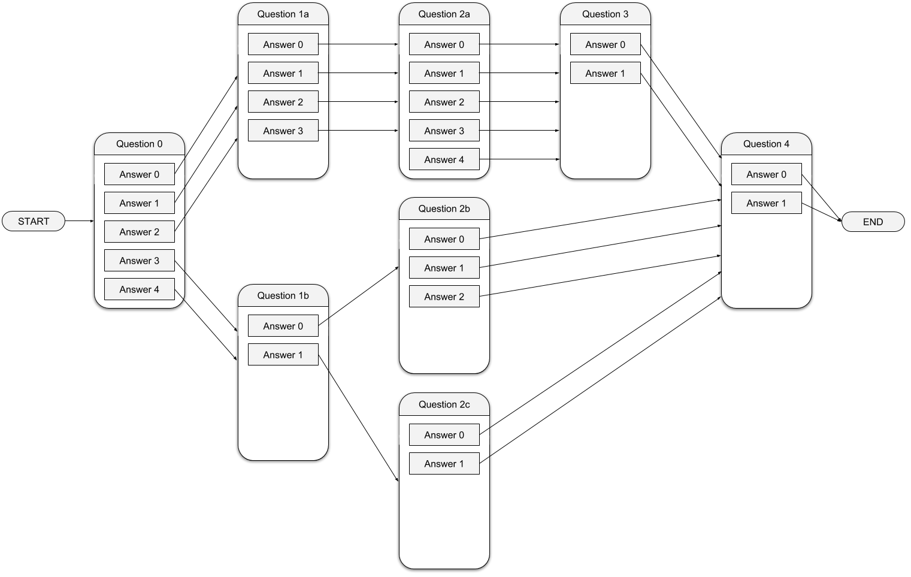

backend-test
============
This is the test for backend or full stack candidates.

We need to build a system that allows serving routed surveys to respondents. A routed survey is a survey that presents different questions depending on the answers that have been given so far by the respondent (see figure below for an example).

Your are tasked with building a function/method that returns a data structure representing the progress of a respondent in a survey. The data structure returned by the function/method needs to contain information about:
1. The next question in this survey that should be presented to the respondent.
2. The number of questions that the respondent has answered so far as part of this survey.
3. The maximum number of questions available in this survey, considering the answers that have already been given by the respondent (if any). This number could change as the respondent provides more answers. Looking at the example in the figure, before any answers have been given to any questions; the maximum number of questions available in the survey is 5 (corresponding to the longest route `0 -> 1a -> 2a -> 3 -> 4`). But, for example, if the user has answered `Question 0` with `Answer 3` or `Answer 4`, the maximum number of questions available in the survey is now 4 (corresponding to route `0 -> 1b -> 2b -> 4` or `0 -> 1b -> 2c -> 4`). Note this number includes both answered and unanswered questions.
4. The amount of money (in pence) earned by the respondent for the answers they have given so far as part of this survey. Each question has an associated amount that it pays the respondents.

The provided Java and Go projects lay out the initial structure and the data needed for the task. The existing code is commented and tested and should be self-explanatory, providing more information that is not provided in this document.

Notes
-----
- For simplicity, all the existing questions are single-choice. When answering a question, a respondent must provide exactly 1 answer.
- The code makes use of the word “taker”: in this context it is a user taking the survey, i.e. a respondent.
- The integer `answer` in taker question answers and in routes corresponds to the answer index (0-based) in the question choices.
- When a question does not have routes, it means it is the last question in the survey.
- If the given answer doesn't have an associated route in the question, it means that it was the last question in the survey.
- You cannot change the existing method definitions, but you can add classes and methods if you feel it's necessary.
- You don't necessarily have to use all the methods defined in the DAOs.
- Pick one between Java and Go (not both!). You are free to use other languages too, but that would mean having to replicate the existing provided Java/Go projects first.
- You should make your own interpretation decisions on ambiguous items, and document them.
- The current implementation is using in-memory data, but imagine the data is actually stored on a database running on a different host.
- Imagine this will be used in a production environment, potentially receiving multiple requests at the same time.
- Consider time and memory performance.

What we will look at
--------------------
We care about (in this order):
1. Correctness: Are all the scenarios considered? Are there any bugs?
2. We are big fans of clean code: Is the code easy to understand?
3. Performance: Is this the most performant possible solution? If not, is the compromise acceptable, what has been gained at the cost of performance, and why?
